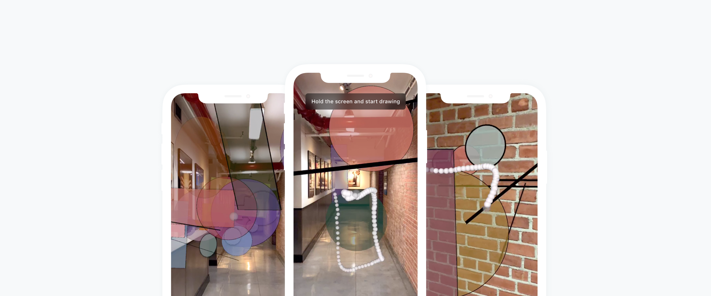

# AR-Drawing
## This is a project that use 2D gesture recognizer in 3D to create drawing shapes in 3D
### Based on [$Q Super-Quick Recognizer](http://depts.washington.edu/madlab/proj/dollar/qdollar.html)

### 3D points to 2D points done
### Classification done
## Visualization
### Shader for shadow added -> See Shader folder
### 2d -> 3D shapes are done

